 

<h3><code>viz-zie@github ~ $ whoami</code></h3>

 
 

<h3><code>viz-zie@github ~ $ ./contributions.sh</code></h3>

<h1 align="center">Hi 👋, I'm Vishranth Karthikheyan</h1>
<h3 align="center">Cybersecurity Enthusiast | Security Analyst Aspirant</h3>

B.Tech Computer Science Engineering (Cyber Physical Systems)  
Vellore Institute of Technology, Chennai

---

I am a Computer Science undergraduate specializing in <b>Cyber Physical Systems</b>, with a strong interest in <b>Cybersecurity, Cloud Security, and Secure Software Development</b>. I am actively building a foundation in security principles, networking, operating systems, and threat analysis while continuously improving my hands-on skills through projects and self-learning.

I am particularly interested in <b>application security, cloud security, vulnerability assessment, and defensive security practices</b>. My goal is to grow into a security professional who can design, analyze, and secure modern systems against real-world threats.

---

---

### 🔐 About Me

- 🎓 B.Tech CSE (Cyber Physical Systems), VIT Chennai  
- 🌱 Currently learning **Cybersecurity fundamentals, Cloud Security, and Machine Learning for Security**
- 🛡️ Interested in **Security Operations, Vulnerability Analysis, Secure Coding**
- 👨‍💻 Projects & portfolio:  
  👉 https://viz-zie.github.io/MyPortfolio/
- 💬 Ask me about **Cybersecurity basics, Frontend Security, Secure Web Practices**
- 📫 Reach me at **thisisvishkarthik@gmail.com**
- 📄 Resume:  
  👉 https://drive.google.com/file/d/1Lk2A63VAzFQNJjh6cBRB6Ib6gaT9V77M/view
- ⚡ Fun fact: **I secure systems by day, become Batman by night 🦇**

---

<h3 align="left">🌐 Connect with Me</h3>

---

  
  

---

<h3>🛠️ Technical Skills</h3>

<b>Cybersecurity & Systems</b> 
- Networking Fundamentals (TCP/IP, DNS, HTTP/S)
- Linux & Windows Internals
- Secure Coding Principles
- Cloud & Application Security (Basics)
- Risk, Threat & Vulnerability Concepts

 

<b>Programming & Scripting</b> 

  
  
  

 

<b>Web & Development</b> 

  
  
  

 

<b>Tools & Platforms</b> 

  
  
  
  

 

<b>Design & Documentation</b> 

  
  

---

<h3 align="center">🚀 Building secure systems, one layer at a time</h3>
